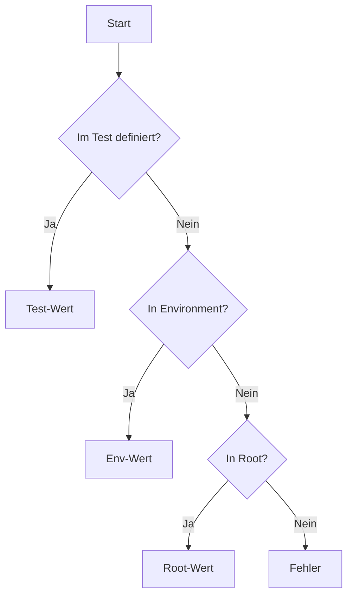

# Variablensystem

TestGyver nutzt ein hierarchisches Variablensystem für Konfigurationen pro Umgebung.

## Variablentypen

### 1. Globale Variablen (Root)
*   In **Admin > Variables** definiert.
*   Standardwerte, falls nichts überschrieben wird.
*   Beispiel: `api_url` = `http://localhost`

### 2. Umgebungsvariablen (Filière)
*   Überschreiben globale Werte für eine Umgebung ("Production", "Staging").
*   Bei Kampagnenstart gewählt.
*   Beispiel: `api_url` für "Production" = `https://api.example.com`

### 3. Sammlungs-Variablen (System)
*   Automatisch während der Ausführung verfügbar.
*   `{{test.test_id}}`: Test-ID.
Deprecated??
*   `{{test.campain_id}}`: Kampagnen-ID.
*   `{{test.work_dir}}`: Pfad zum Workdir.
*   `{{test.files_dir}}`: Pfad zu Kampagnen-Dateien.

### 4. Test-Variablen
*   Spezifisch für einen Testfall.
*   Nützlich für parametrisierte Tests.
*   Zugriff: `{{app.variable_name}}`.

## Auflösung

Wird `{{my_var}}` genutzt:

## Verwaltung

Gehe zu **Admin > Variables**.
*   **Create Root**: Neue Variable anlegen.
*   **Add Environment Value**: Wert pro Umgebung setzen.
