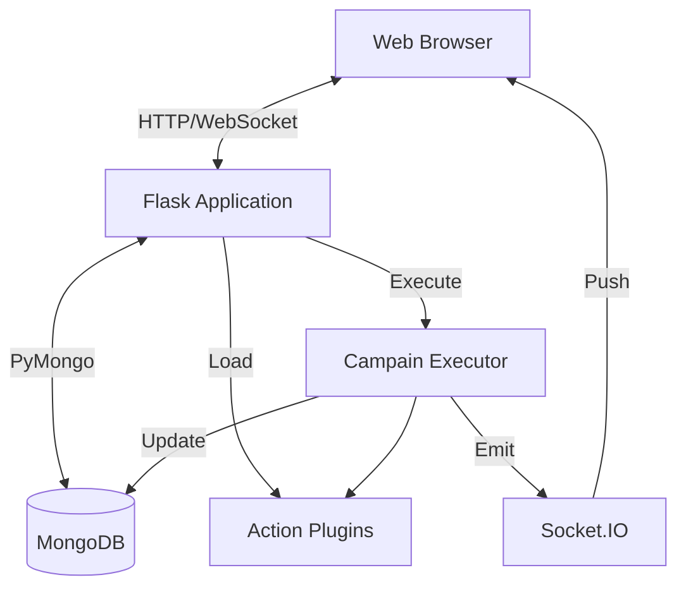

# Architektur-Übersicht

TestGyver ist eine monolithische Web-App mit modularem Plugin-System.

## High-Level-Diagramm

## Kernkomponenten

### 1. Flask-App (`app.py`)
Entry Point. Initialisiert:
*   DB-Verbindung
*   Auth (JWT)
*   Blueprints (Routes)
*   SocketIO
*   Plugin-Manager

### 2. Daten-Layer (`models/`)
Abstraktion über MongoDB via PyMongo.
*   **Users**, **Variables**, **Campaigns/Tests**, **Reports**

### 3. Plugins (`plugins/`)
Dynamisches Laden von Aktionen.
*   **PluginManager**: Scan & Load
*   **ActionBase**: Abstrakte Basis

### 4. Execution Engine (`utils/campain_executor.py`)
Background-Thread/Prozess.
*   Läuft Tests/Aktionen
*   Variablenauflösung
*   Logs/Timings
*   DB-Updates & WebSocket-Events

### 5. Frontend
*   Jinja2, Bootstrap 5, jQuery/Vanilla JS
*   Socket.IO Client für Echtzeit
