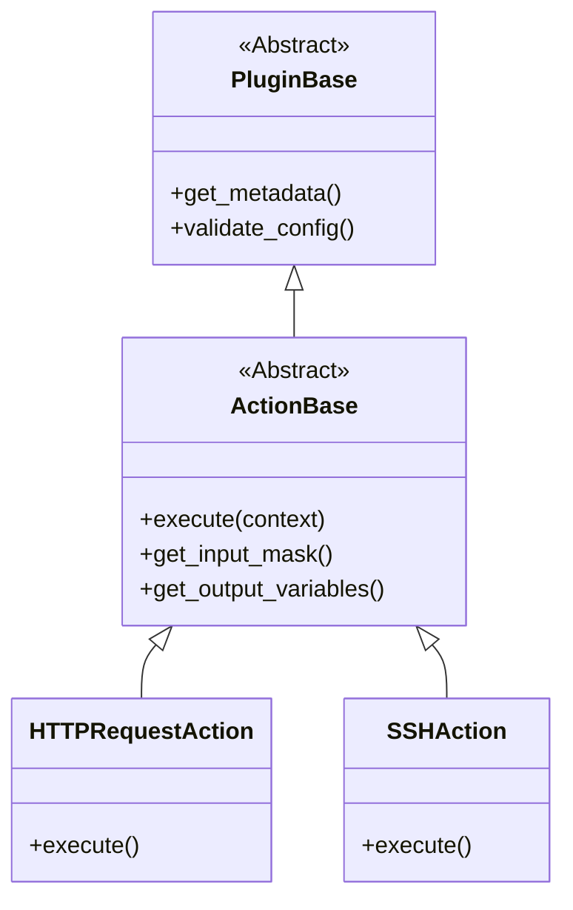

# Plugin-System-Architektur

Das Plugin-System ist erweiterbar und lose gekoppelt. Neue Funktionen ohne Core-Änderungen.

## Klassenhierarchie

## Plugin Manager

`PluginManager` (`plugins/plugin_manager.py`) übernimmt:
1.  **Discovery**: Scan von `plugins/actions/`.
2.  **Loading**: Dynamisches Importieren.
3.  **Registration**: Prüfen auf `ActionBase` und registrieren.

## Lifecycle

1.  **Startup**: `app.py` initialisiert Manager. Plugins im Speicher.
2.  **UI**: Beim Hinzufügen einer Aktion fragt die UI die Liste/masks per API ab.
3.  **Execution**: `CampainExecutor` sucht Klasse, instanziiert und ruft `execute()` auf.
