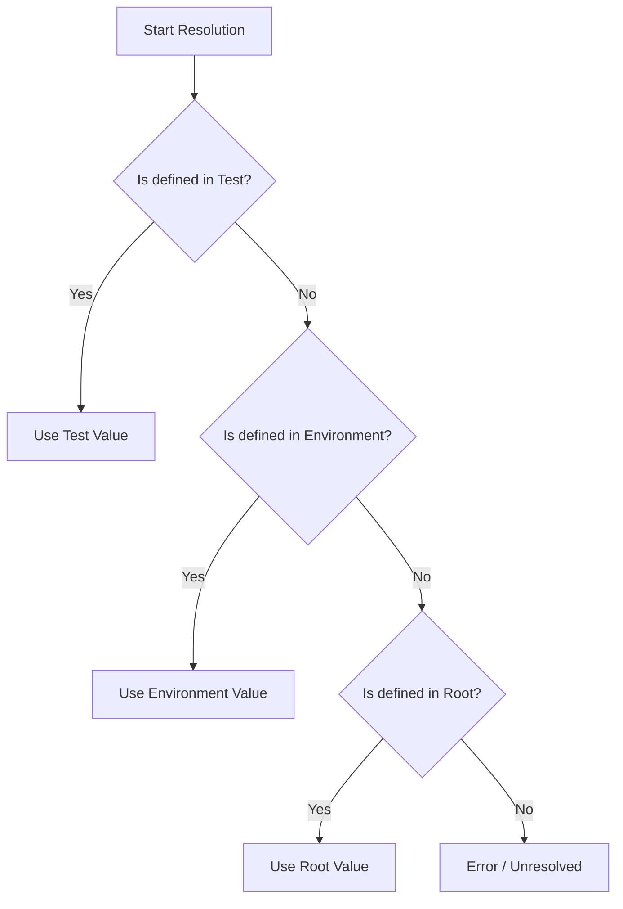

# Variables System

TestGyver uses a powerful hierarchical variable system to manage configuration across different environments.

## Variable Types

### 1. Global Variables (Root)
*   Defined in **Admin > Variables**.
*   These are the default values if no environment-specific value overrides them.
*   Example: `api_url` = `http://localhost`

### 2. Environment Variables (Filière)
*   Overrides Global Variables for a specific environment (e.g., "Production", "Staging").
*   Selected when launching a campaign.
*   Example: `api_url` for "Production" = `https://api.example.com`

### 3. Collection Variables (System)
*   Automatically provided by the system during execution.
*   `{{test.test_id}}`: ID of the current test.
*   `{{test.campain_id}}`: ID of the current campaign.
*   `{{test.work_dir}}`: Path to the campaign's working directory.
*   `{{test.files_dir}}`: Path to the campaign's file storage.

### 4. Test Variables
*   Defined specifically for a single test case.
*   Useful for parameterized tests.
*   Accessed via `{{app.variable_name}}`.

## Resolution Logic

When a variable `{{my_var}}` is used in an action:

## Managing Variables

Go to **Admin > Variables** to manage your configuration.
*   **Create Root**: Adds a new variable key.
*   **Add Environment Value**: Defines a value for an existing key in a specific environment.
