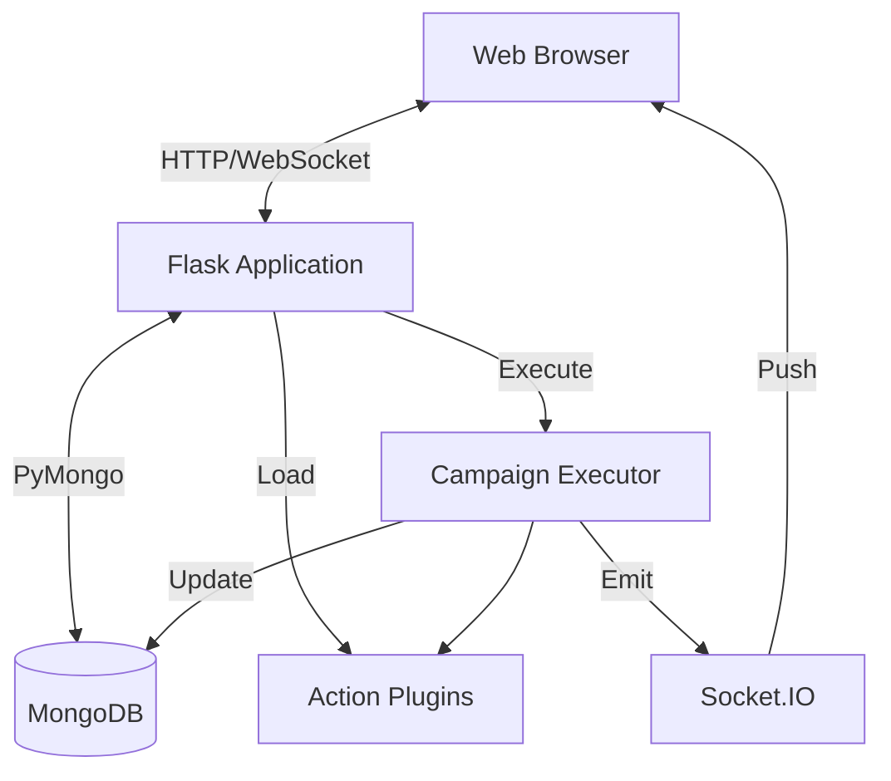

# Architecture Overview

TestGyver is built as a monolithic web application with a modular plugin system.

## High-Level Diagram

## Core Components

### 1. Flask Application (`app.py`)
The entry point. It initializes:
*   Database connection.
*   Authentication (JWT).
*   Blueprints (Routes).
*   SocketIO for real-time communication.
*   Plugin Manager.

### 2. Database Layer (`models/`)
Abstraction over MongoDB using PyMongo.
*   **Users**: Authentication and roles.
*   **Variables**: Configuration management.
*   **Campaigns/Tests**: Test definitions.
*   **Reports**: Execution results.

### 3. Plugin System (`plugins/`)
A dynamic loading system that discovers and registers actions.
*   **PluginManager**: Scans directories and loads classes.
*   **ActionBase**: Abstract base class for all actions.

### 4. Execution Engine (`utils/campain_executor.py`)
Runs in a background thread/process.
*   Iterates through tests and actions.
*   Resolves variables.
*   Executes plugins.
*   Captures logs and timings.
*   Updates the database and emits WebSocket events.

### 5. Frontend
*   Server-side rendering with **Jinja2**.
*   **Bootstrap 5** for layout.
*   **jQuery** (legacy) and vanilla JS for interactivity.
*   **Socket.IO Client** for real-time updates.
