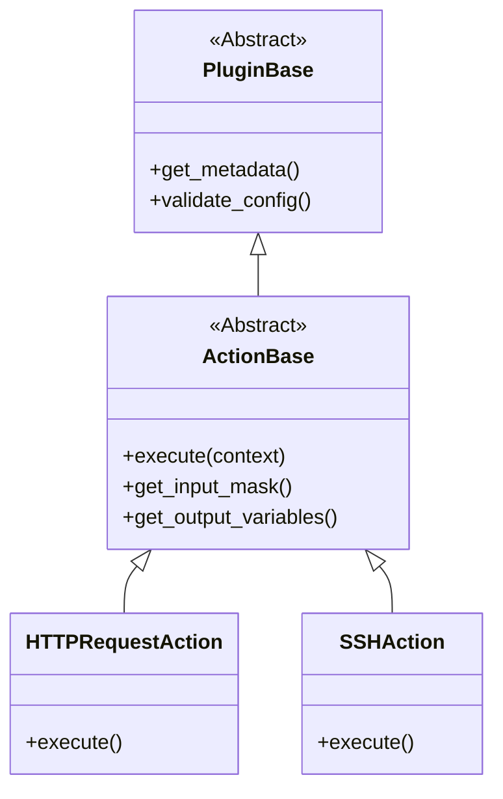

# Plugin System Architecture

The plugin system is designed to be extensible and loosely coupled. It allows adding new functionality without modifying the core application code.

## Class Hierarchy

## The Plugin Manager

The `PluginManager` (`plugins/plugin_manager.py`) is responsible for:
1.  **Discovery**: Scanning the `plugins/actions/` directory for Python files.
2.  **Loading**: Importing modules dynamically.
3.  **Registration**: Verifying that classes inherit from `ActionBase` and registering them in a dictionary.

## Lifecycle

1.  **Startup**: `app.py` initializes `PluginManager`. Plugins are loaded into memory.
2.  **UI Rendering**: When a user adds an action, the UI requests the list of available plugins and their input masks via the API.
3.  **Execution**: When a test runs, the `CampainExecutor` looks up the plugin class by name, instantiates it, and calls `execute()`.
