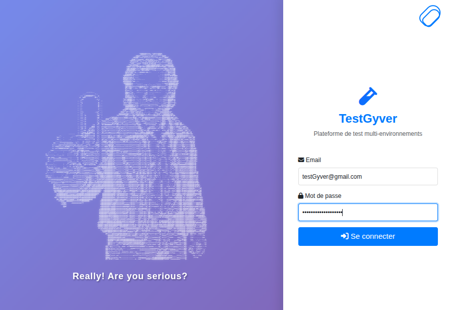
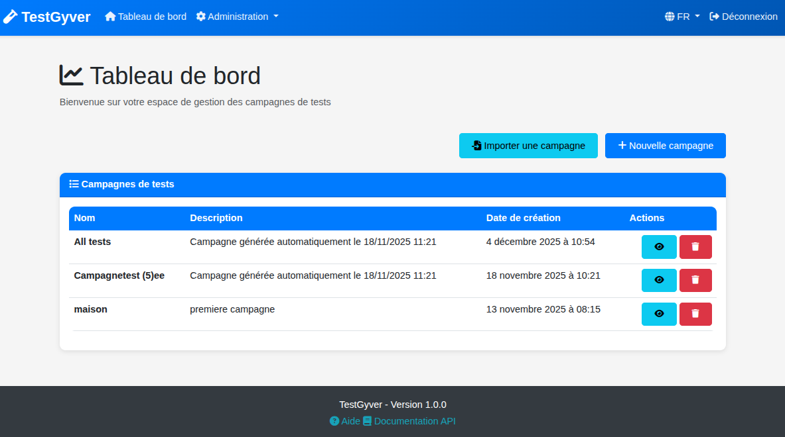

# Primeros Pasos

¡Bienvenido a TestGyver! Esta guía te ayuda a navegar la aplicación por primera vez.

## Login

Accede a la URL configurada (por defecto: `http://localhost:5000`). Verás la página de login con nuestra mascota.

*   **Credenciales Admin por defecto** (si fueron inicializadas):
    *   Email: `admin@test.com`
    *   Contraseña: `Password123`

> Página de login con la mascota pixel art.

## Visión General del Dashboard

Al iniciar sesión llegas al **Dashboard**.

> Dashboard con lista de campañas y barra de navegación.

*   **Lista de Campañas**: Zona central con tus campañas.
*   **Barra de navegación**:
    *   **Dashboard**: Volver a inicio.
    *   **Admin** (solo Admin): Gestión de Usuarios y Variables.
    *   **Selector de idioma**: Cambiar idioma disponible.
    *   **Logout**: Cerrar sesión.
*   **Footer**: Muestra la versión de la app y enlace a la API Swagger.

## Primeros Pasos

1.  **Crear una Campaña**: Clic en "Añadir Campaña".
2.  **Agregar Tests**: Completa los datos y añade tests.
3.  **Ejecutar**: Lanza la campaña y mira resultados en tiempo real.
