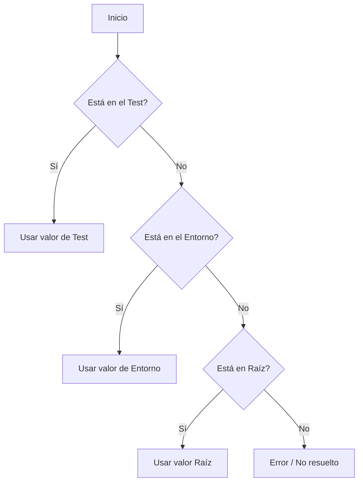

# Sistema de Variables

TestGyver usa un sistema jerárquico de variables para gestionar la configuración según el entorno.

## Tipos de Variables

### 1. Variables Globales (Raíz)
*   Definidas en **Admin > Variables**.
*   Valores por defecto si no hay override de entorno.
*   Ejemplo: `api_url` = `http://localhost`

### 2. Variables de Entorno (Filière)
*   Sobrescriben las globales para un entorno ("Producción", "Staging").
*   Se eligen al lanzar una campaña.
*   Ejemplo: `api_url` para "Producción" = `https://api.example.com`

### 3. Variables de Colección (Sistema)
*   Proporcionadas automáticamente durante la ejecución.
*   `{{test.test_id}}`: ID del test.
*   `{{test.campain_id}}`: ID de la campaña.
*   `{{test.work_dir}}`: Ruta del workdir de la campaña.
*   `{{test.files_dir}}`: Ruta de los ficheros.

### 4. Variables de Test
*   Definidas para un caso de prueba concreto.
*   Útiles para tests parametrizados.
*   Acceso: `{{app.variable_name}}`.

## Lógica de Resolución

Cuando usas `{{my_var}}` en una acción:

## Gestión de Variables

Ve a **Admin > Variables**.
*   **Create Root**: Añade una clave.
*   **Add Environment Value**: Define un valor para una clave en un entorno.
