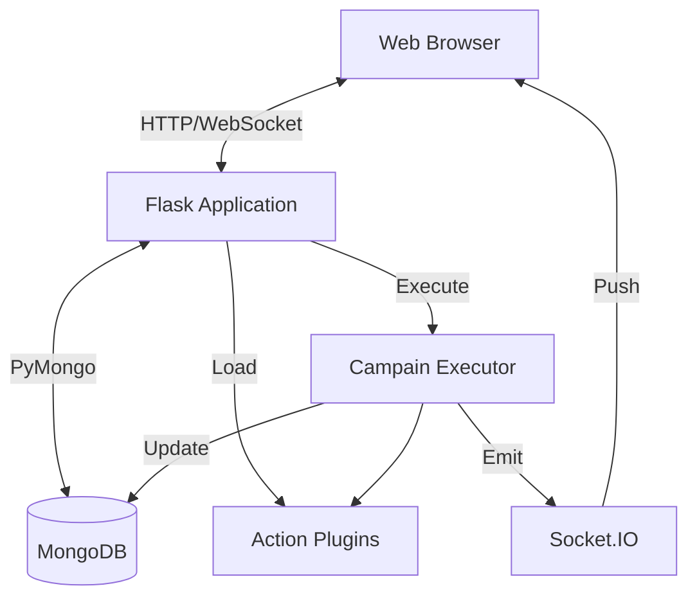

# Visión General de Arquitectura

TestGyver es una aplicación web monolítica con un sistema de plugins modular.

## Diagrama de Alto Nivel

## Componentes Clave

### 1. Aplicación Flask (`app.py`)
Punto de entrada. Inicializa:
*   Conexión a base de datos.
*   Autenticación (JWT).
*   Blueprints (Rutas).
*   SocketIO para tiempo real.
*   Gestor de Plugins.

### 2. Capa de Datos (`models/`)
Abstracción sobre MongoDB con PyMongo.
*   **Users**: Autenticación y roles.
*   **Variables**: Gestión de configuración.
*   **Campaigns/Tests**: Definiciones de prueba.
*   **Reports**: Resultados de ejecución.

### 3. Sistema de Plugins (`plugins/`)
Carga dinámica y registro de acciones.
*   **PluginManager**: Escanea y carga clases.
*   **ActionBase**: Clase base abstracta.

### 4. Motor de Ejecución (`utils/campain_executor.py`)
Corre en hilo/proceso en background.
*   Itera tests y acciones.
*   Resuelve variables.
*   Ejecuta plugins.
*   Captura logs y tiempos.
*   Actualiza la base y emite eventos WebSocket.

### 5. Frontend
*   Renderizado server-side con **Jinja2**.
*   **Bootstrap 5** para layout.
*   **jQuery** (legado) y JS vanilla.
*   **Socket.IO Client** para tiempo real.
