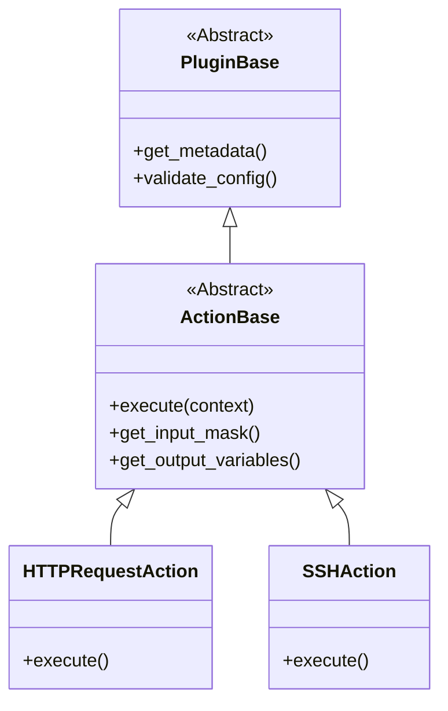

# Arquitectura del Sistema de Plugins

El sistema de plugins es extensible y desacoplado. Permite añadir funcionalidad sin tocar el núcleo.

## Jerarquía de Clases

## Gestor de Plugins

`PluginManager` (`plugins/plugin_manager.py`) se encarga de:
1.  **Descubrir**: Escanear `plugins/actions/`.
2.  **Cargar**: Importar módulos dinámicamente.
3.  **Registrar**: Verificar herencia de `ActionBase` y registrarlos.

## Ciclo de Vida

1.  **Startup**: `app.py` inicializa `PluginManager`. Plugins cargados en memoria.
2.  **Render UI**: La UI solicita la lista de plugins y máscaras via API.
3.  **Ejecución**: `CampainExecutor` busca la clase por nombre, instancia y ejecuta `execute()`.
