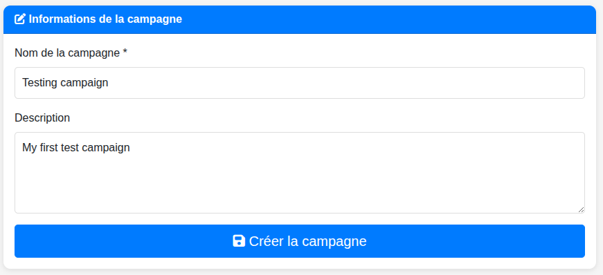
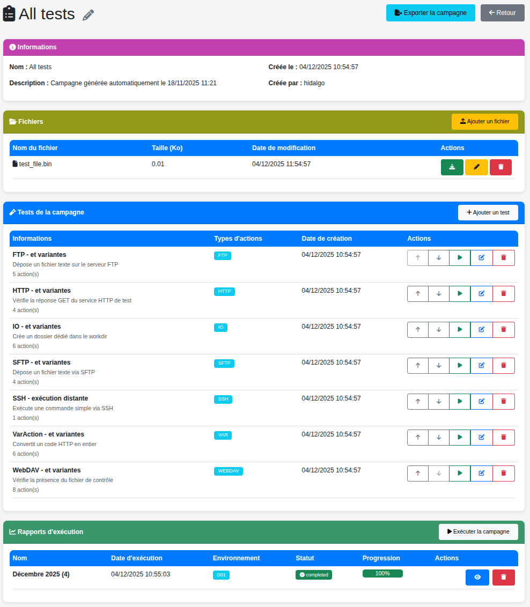

# Gestion des Campagnes

Une **Campagne** est un regroupement logique de tests conçus pour valider une fonctionnalité ou un flux de travail spécifique.

## Créer une Campagne

1.  Depuis le Tableau de Bord, cliquez sur **Ajouter une Campagne**.
2.  Remplissez les détails :
    *   **Nom** : Un nom unique pour votre campagne.
    *   **Description** : Détails optionnels sur l'objectif de la campagne.
3.  Cliquez sur **Enregistrer**. Vous serez redirigé vers la page de Détails de la Campagne.

> Le formulaire "Ajouter une Campagne".

## Vue Détails de la Campagne

C'est le centre de contrôle de votre campagne.

> Page de détails d'une campagne montrant les sections Informations, Fichiers et Tests.

### 1. Informations
Affiche les métadonnées de la campagne. Vous pouvez modifier ou supprimer la campagne d'ici.

### 2. Gestion des Fichiers
Cette section vous permet de gérer les fichiers associés à la campagne (ex: fichiers de données pour les tests, ressources uploadées).
*   **Uploader** : Ajouter des fichiers au répertoire de travail de la campagne.
*   **Renommer/Supprimer** : Gérer les fichiers existants.
*   **Télécharger** : Récupérer les fichiers.

Ces fichiers sont accessibles dans vos tests via la variable `{{test.files_dir}}`.

### 3. Liste des Tests
Affiche tous les tests de la campagne.
*   **Réorganiser** : Utilisez les flèches Haut/Bas pour changer l'ordre d'exécution.
*   **Ajouter un Test** : Créer un nouveau cas de test.
*   **Exécuter** : Lancer un test spécifique individuellement.

## Exécuter une Campagne

1.  Cliquez sur le bouton **Lancer la Campagne**.
2.  **Configurer l'Exécution** :
    *   **Nom** : Auto-généré (ex: "Mars 2023"), mais personnalisable.
    *   **Environnement** : Sélectionnez l'environnement cible (défini dans les Variables).
    *   **Arrêt sur Erreur** : Si coché, la campagne s'arrête immédiatement si un test échoue.
3.  **Lancer** : L'exécution démarre en arrière-plan.

> La modale "Lancer la Campagne" avec la sélection de l'environnement.

### Suivi en Temps Réel
Vous verrez une barre de progression et des mises à jour de statut.
*   **Bleu** : En cours
*   **Vert** : Terminé avec succès
*   **Rouge** : Échoué

Cliquez sur un rapport en cours ou terminé pour voir les logs détaillés.
