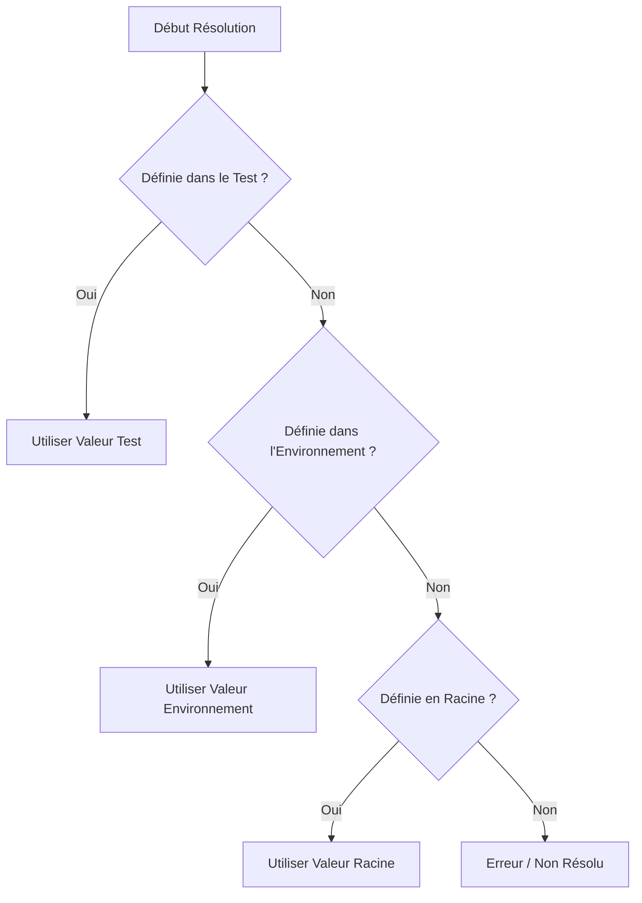

# Système de Variables

TestGyver utilise un système de variables hiérarchique puissant pour gérer la configuration à travers différents environnements.

## Types de Variables

### 1. Variables Globales (Racine)
*   Définies dans **Admin > Variables**.
*   Ce sont les valeurs par défaut si aucune valeur spécifique à l'environnement ne les surcharge.
*   Exemple : `api_url` = `http://localhost`

### 2. Variables d'Environnement (Filière)
*   Surcharge les Variables Globales pour un environnement spécifique (ex: "Production", "Staging").
*   Sélectionné lors du lancement d'une campagne.
*   Exemple : `api_url` pour "Production" = `https://api.example.com`

### 3. Variables de Collection (Système)
*   Fournies automatiquement par le système pendant l'exécution.
*   `{{test.test_id}}` : ID du test en cours.
*   `{{test.campain_id}}` : ID de la campagne en cours.
*   `{{test.work_dir}}` : Chemin vers le répertoire de travail de la campagne.
*   `{{test.files_dir}}` : Chemin vers le stockage de fichiers de la campagne.

### 4. Variables de Test
*   Définies spécifiquement pour un cas de test unique.
*   Utile pour les tests paramétrés.
*   Accessibles via `{{app.variable_name}}`.

## Logique de Résolution

Lorsqu'une variable `{{my_var}}` est utilisée dans une action :

## Gérer les Variables

Allez dans **Admin > Variables** pour gérer votre configuration.
*   **Créer Racine** : Ajoute une nouvelle clé de variable.
*   **Ajouter Valeur Environnement** : Définit une valeur pour une clé existante dans un environnement spécifique.

## Obfuscation des Variables

Pour des raisons de sécurité, il est possible de masquer la valeur de certaines variables sensibles (mots de passe, clés d'API, tokens, etc.).

### Fonctionnement
*   Lors de la création ou de la modification d'une variable, cochez la case **"Obfusquer la valeur"**.
*   La valeur sera masquée dans l'interface d'administration (affichée comme `*****`).
*   Lors de l'exécution des tests, la valeur réelle sera utilisée, mais elle sera remplacée par `*****` dans les logs d'exécution.

### Précautions
*   L'obfuscation empêche l'affichage accidentel dans l'interface et les logs standards.
*   Cependant, si un test est conçu pour explicitement exporter ou afficher la valeur (par exemple, écrire la variable dans un fichier texte non sécurisé), la valeur pourrait être exposée.
*   Assurez-vous que vos scripts de test ne tentent pas de contourner cette protection.
