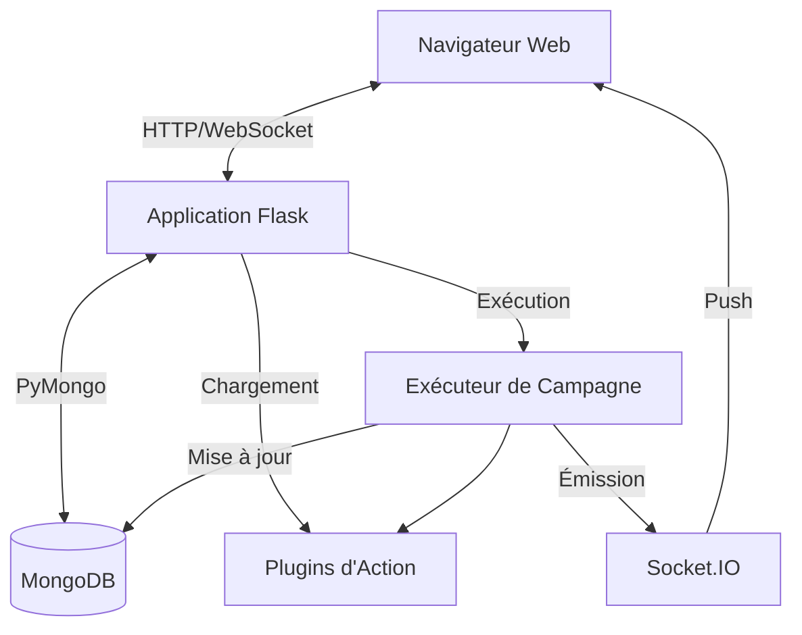

# Aperçu de l'Architecture

TestGyver est construit comme une application web monolithique avec un système de plugins modulaire.

## Diagramme de Haut Niveau

## Composants Principaux

### 1. Application Flask (`app.py`)
Le point d'entrée. Il initialise :
*   La connexion à la base de données.
*   L'authentification (JWT).
*   Les Blueprints (Routes).
*   SocketIO pour la communication temps réel.
*   Le Gestionnaire de Plugins.

### 2. Couche Base de Données (`models/`)
Abstraction sur MongoDB utilisant PyMongo.
*   **Users** : Authentification et rôles.
*   **Variables** : Gestion de la configuration.
*   **Campaigns/Tests** : Définitions des tests.
*   **Reports** : Résultats d'exécution.

### 3. Système de Plugins (`plugins/`)
Un système de chargement dynamique qui découvre et enregistre les actions.
*   **PluginManager** : Scanne les répertoires et charge les classes.
*   **ActionBase** : Classe de base abstraite pour toutes les actions.

### 4. Moteur d'Exécution (`utils/campain_executor.py`)
S'exécute dans un thread/processus d'arrière-plan.
*   Itère à travers les tests et les actions.
*   Résout les variables.
*   Exécute les plugins.
*   Capture les logs et les temps d'exécution.
*   Met à jour la base de données et émet les événements WebSocket.

### 5. Frontend
*   Rendu côté serveur avec **Jinja2**.
*   **Bootstrap 5** pour la mise en page.
*   **jQuery** (héritage) et JS vanilla pour l'interactivité.
*   **Client Socket.IO** pour les mises à jour temps réel.
