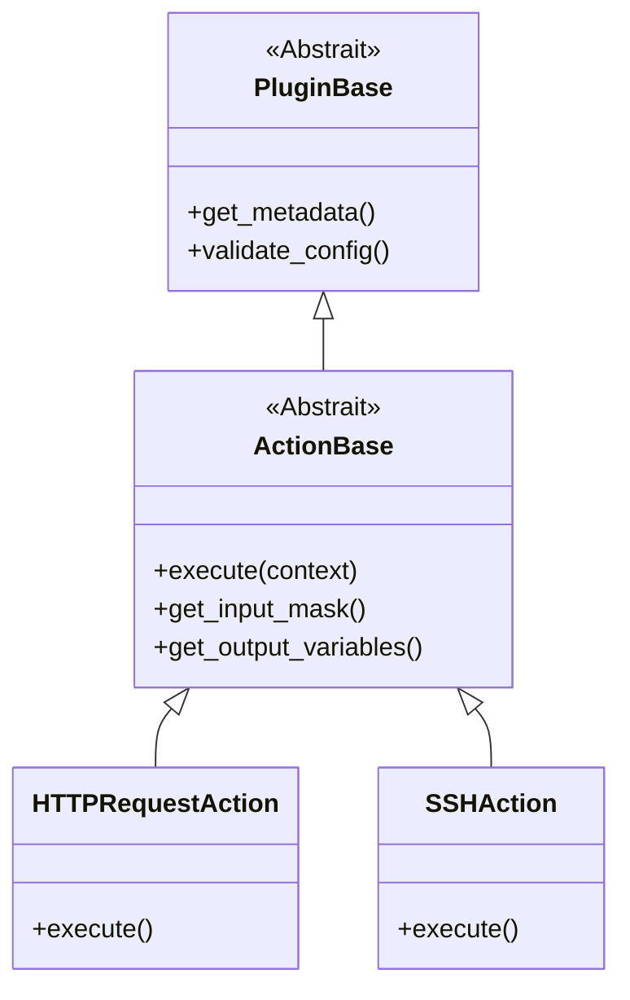

# Architecture du Système de Plugins

Le système de plugins est conçu pour être extensible et faiblement couplé. Il permet d'ajouter de nouvelles fonctionnalités sans modifier le code principal de l'application.

## Hiérarchie des Classes

## Le Gestionnaire de Plugins

Le `PluginManager` (`plugins/plugin_manager.py`) est responsable de :
1.  **Découverte** : Scanner le répertoire `plugins/actions/` pour trouver des fichiers Python.
2.  **Chargement** : Importer les modules dynamiquement.
3.  **Enregistrement** : Vérifier que les classes héritent de `ActionBase` et les enregistrer dans un dictionnaire.

## Cycle de Vie

1.  **Démarrage** : `app.py` initialise `PluginManager`. Les plugins sont chargés en mémoire.
2.  **Rendu UI** : Lorsqu'un utilisateur ajoute une action, l'interface demande la liste des plugins disponibles et leurs masques de saisie via l'API.
3.  **Exécution** : Lorsqu'un test s'exécute, le `CampainExecutor` recherche la classe du plugin par son nom, l'instancie, et appelle `execute()`.
