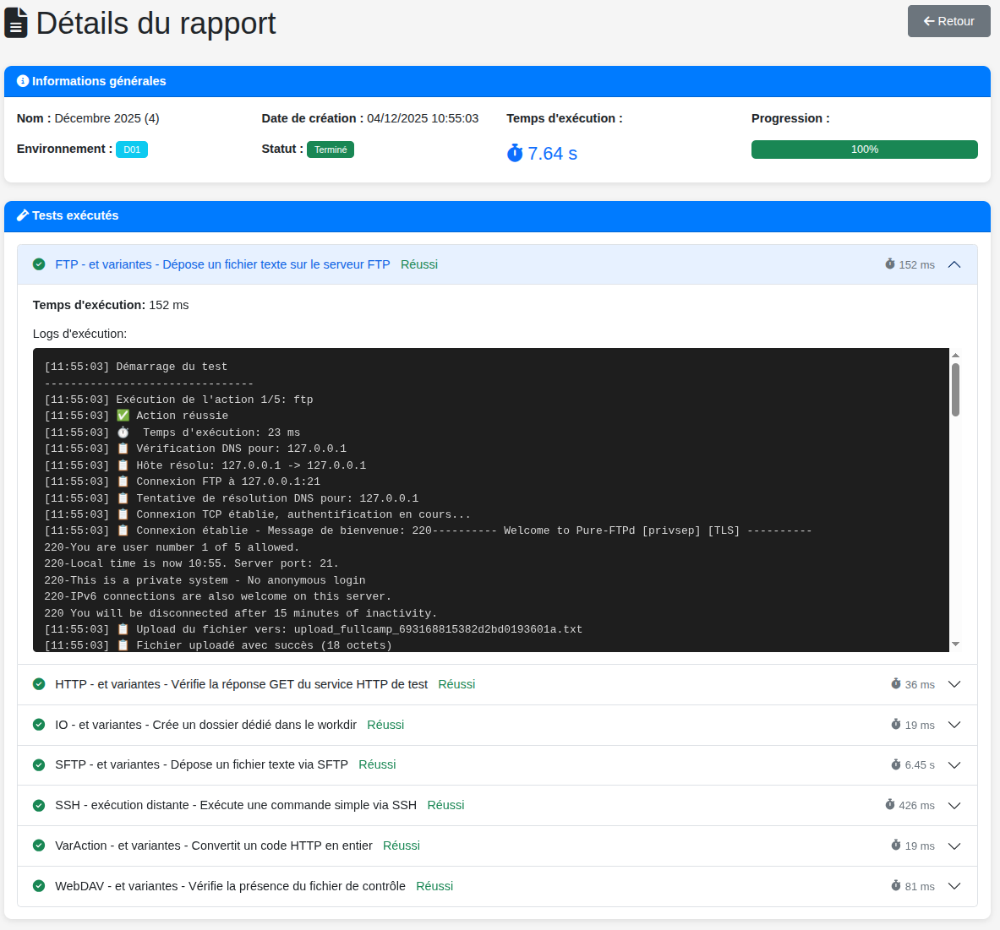

# Report e Monitoraggio

I report forniscono lo storico dettagliato delle esecuzioni.

## Accesso ai Report

*   **Dal Dashboard**: Tab "Reports" (se presente) o dalla campagna.
*   **Dalla Campagna**: Sezione "Reports" elenca tutte le esecuzioni.

## Dettaglio Report

Cliccando apri la vista dettagliata:

> Pagina report con stato e lista test.

### Header
*   **Status**: Success, Failure o Running.
*   **Progress**: Percentuale completata.
*   **Environment**: Ambiente usato.
*   **Timings**: Inizio, Fine, Durata.

### Risultati Test
Elenco di tutti i test eseguiti.
*   **Icona stato**: ✅ Pass / ❌ Fail.
*   **Log**: Espandi per tracce.
    *   Dati inviati/ricevuti.
    *   Tempo per azione.
    *   Errori se presenti.

## Aggiornamenti in Tempo Reale
WebSocket aggiorna in tempo reale. Nessun refresh necessario.
