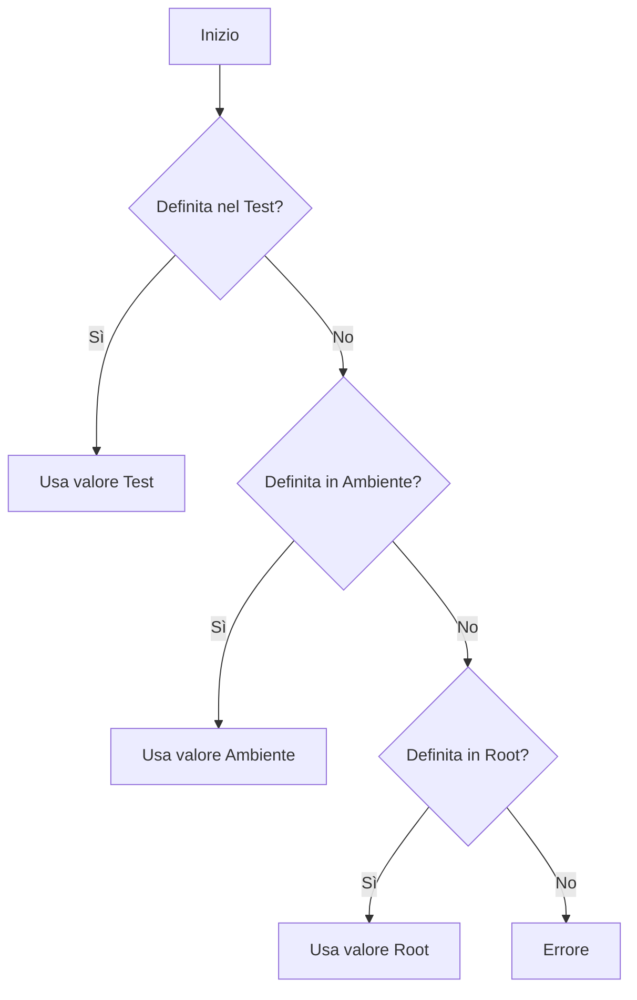

# Sistema di Variabili

TestGyver usa un sistema gerarchico di variabili per gestire la configurazione per ambiente.

## Tipi di Variabili

### 1. Variabili Globali (Root)
*   Definite in **Admin > Variables**.
*   Valori di default.
*   Esempio: `api_url` = `http://localhost`

### 2. Variabili di Ambiente (Filière)
*   Sovrascrivono le globali per un ambiente ("Production", "Staging").
*   Selezionate al lancio della campagna.
*   Esempio: `api_url` per "Production" = `https://api.example.com`

### 3. Variabili di Collezione (Sistema)
*   Fornite automaticamente in esecuzione.
*   `{{test.test_id}}`: ID test.
*   `{{test.campain_id}}`: ID campagna.
*   `{{test.work_dir}}`: Path workdir.
Deprecated??
*   `{{test.files_dir}}`: Path file.

### 4. Variabili di Test
*   Definite per un singolo test.
*   Utili per test parametrizzati.
*   Accesso: `{{app.variable_name}}`.

## Logica di Risoluzione

Usando `{{my_var}}`:

## Gestione Variabili

Vai in **Admin > Variables**.
*   **Create Root**: Aggiunge una chiave.
*   **Add Environment Value**: Valore per un ambiente.
