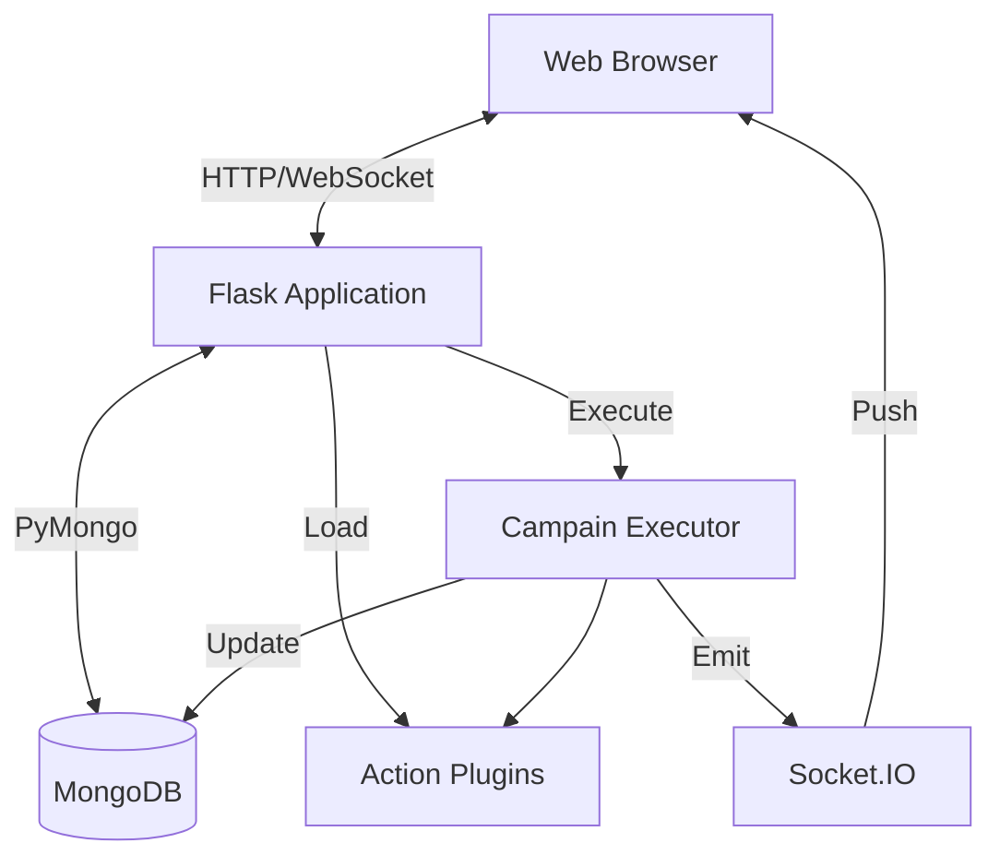

# Panoramica Architettura

TestGyver è una webapp monolitica con sistema di plugin modulare.

## Diagramma Alto Livello

## Componenti Chiave

### 1. Applicazione Flask (`app.py`)
Entry point. Inizializza DB, Auth (JWT), Blueprints, SocketIO, Plugin Manager.

### 2. Layer Dati (`models/`)
Astrazione MongoDB con PyMongo.
*   **Users**, **Variables**, **Campaigns/Tests**, **Reports**.

### 3. Sistema Plugin (`plugins/`)
Caricamento dinamico delle azioni.
*   **PluginManager**: Scopre e carica.
*   **ActionBase**: Base astratta.

### 4. Motore di Esecuzione (`utils/campain_executor.py`)
Thread/processo in background.
*   Esegue tests/azioni, risolve variabili, log/tempi, aggiorna DB, emette WebSocket.

### 5. Frontend
*   Jinja2, Bootstrap 5, jQuery/JS vanilla, Socket.IO client.
