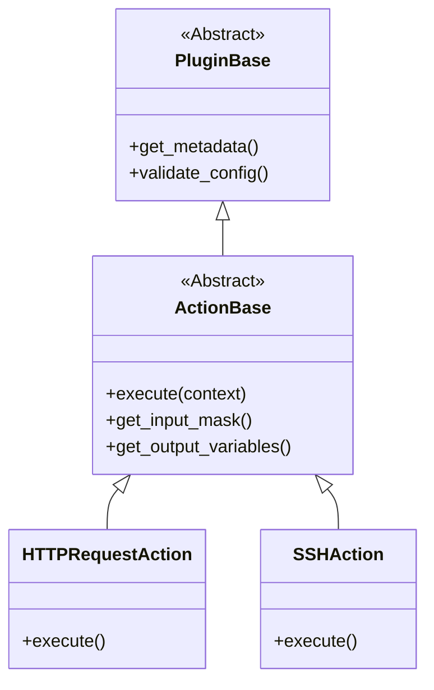

# Architettura Sistema Plugin

Sistema plugin estensibile e disaccoppiato. Aggiungi funzionalità senza toccare il core.

## Gerarchia Classi

## Plugin Manager

`PluginManager` (`plugins/plugin_manager.py`) gestisce:
1.  **Discovery** di `plugins/actions/`.
2.  **Loading** dinamico.
3.  **Registration**: verifica eredità da `ActionBase` e registra.

## Ciclo di Vita

1.  **Startup**: `app.py` inizializza, plugin in memoria.
2.  **UI**: la UI chiede lista plugin e mask via API.
3.  **Execution**: `CampainExecutor` trova la classe, istanzia, chiama `execute()`.
