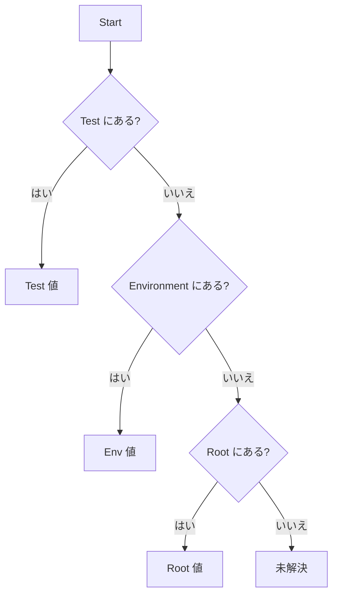

# 変数システム

TestGyver は階層的な変数で環境ごとの設定を管理します。

## 変数の種類

### 1. グローバル変数（Root）
*   **Admin > Variables** で定義。
*   デフォルト値。
*   例: `api_url` = `http://localhost`

### 2. 環境変数（Filière）
*   特定環境向けにグローバルを上書き。
*   キャンペーン実行時に選択。
*   例: Production 用 `api_url` = `https://api.example.com`

### 3. コレクション変数（System）
*   実行中に自動提供。
*   `{{test.test_id}}`, `{{test.campain_id}}`, `{{test.work_dir}}`, `{{test.files_dir}}`

### 4. テスト変数
*   個別テスト専用。
*   パラメトリックなテストに有用。
*   `{{app.variable_name}}` で参照。

## 解決ロジック

`{{my_var}}` の解決順：

## 管理

**Admin > Variables** で操作。
*   **Create Root**: キーを追加。
*   **Add Environment Value**: 環境別の値を設定。
