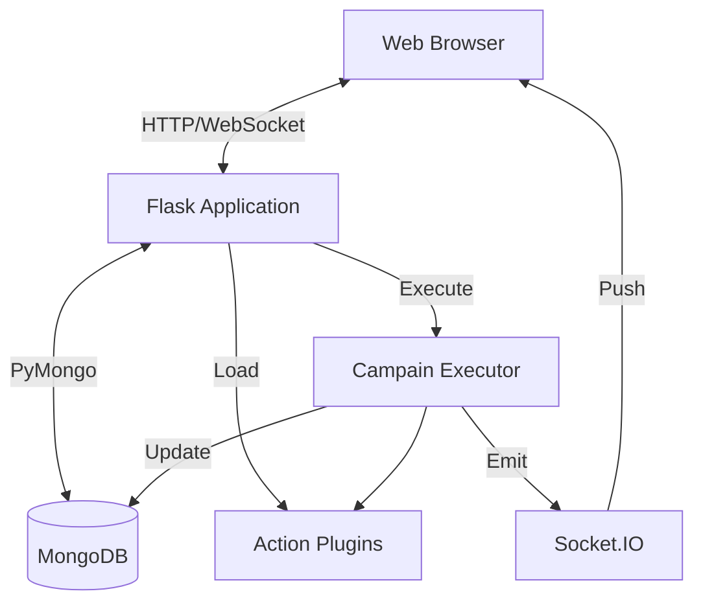

# アーキテクチャ概要

TestGyver は単体 Web アプリ + モジュール型プラグインシステムです。

## ハイレベル図

## コアコンポーネント

### 1. Flask アプリ (`app.py`)
DB 接続、JWT 認証、Blueprint、SocketIO、プラグイン管理を初期化。

### 2. データ層 (`models/`)
PyMongo を使った MongoDB 抽象。

### 3. プラグインシステム (`plugins/`)
動的にアクションを読み込み。
*   PluginManager: スキャン/読み込み
*   ActionBase: 抽象基底

### 4. 実行エンジン (`utils/campain_executor.py`)
バックグラウンドでテスト/アクションを実行し、変数解決・ログ・時間計測・DB 更新・WebSocket 配信。

### 5. フロントエンド
Jinja2 + Bootstrap 5 + jQuery/JS、Socket.IO クライアントでリアルタイム更新。
