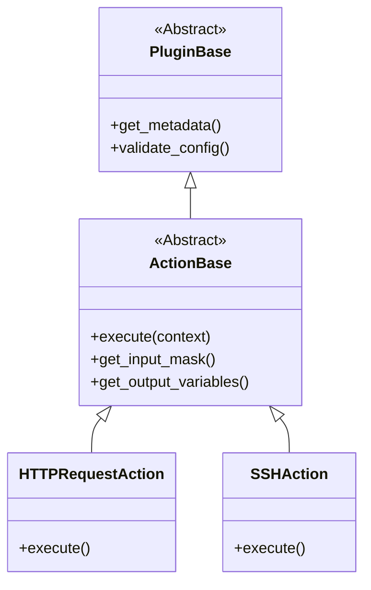

# プラグインシステムのアーキテクチャ

プラグインシステムは拡張しやすく疎結合で、コアを触らずに機能追加できます。

## クラス階層

## プラグインマネージャ

`PluginManager` (`plugins/plugin_manager.py`) の役割:
1.  **探索**: `plugins/actions/` をスキャン。
2.  **ロード**: モジュールを動的インポート。
3.  **登録**: `ActionBase` 継承を確認し登録。

## ライフサイクル

1.  **起動**: `app.py` が PluginManager を初期化しメモリにロード。
2.  **UI**: アクション追加時、API 経由でプラグイン一覧/入力マスクを取得。
3.  **実行**: `CampainExecutor` が名前でクラスを解決し `execute()` を呼ぶ。
