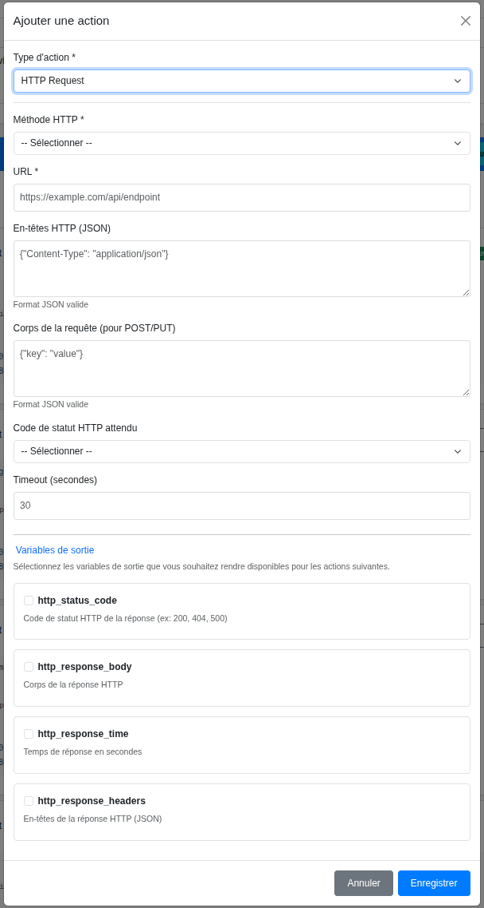
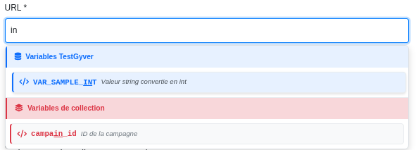

# 测试与动作

**测试** 是一系列 **动作**，按顺序执行。

## 创建测试

1.  在活动中点击 **Add Test**。
2.  填写名称、描述。
3.  （可选）添加测试变量（如 `username`）。

## 添加动作

1.  点击 **Add Action**。
2.  选择动作类型：HTTP、SSH、Wait 等。
3.  配置参数。

> 动作配置表单（HTTP 示例）。

### 变量自动完成
输入时会提示变量：

> 输入 `{{` 时的下拉提示。

*   **全局变量**：`{{variable_name}}`
*   **测试变量**：`{{app.variable_name}}`
*   **集合变量**：`{{test.test_id}}`, `{{test.files_dir}}`

### 输出变量
部分动作产生输出（如 HTTP 响应）。
*   在配置中显示为 **Output Variables**。
*   可在后续动作中使用。

## 顺序
按列表顺序执行，可拖拽或用箭头调整。

## 执行
可在测试详情页单独运行测试，先行验证。
