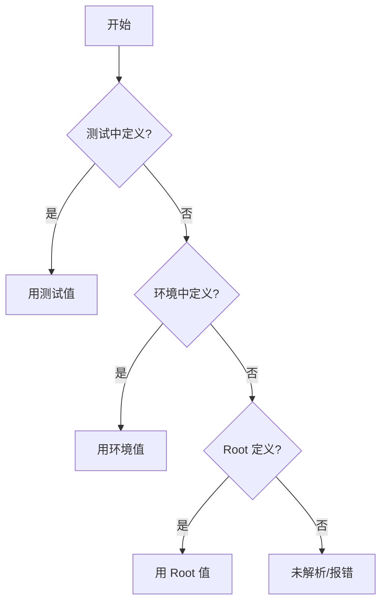

# 变量系统

TestGyver 使用分层变量系统管理不同环境的配置。

## 变量类型

### 1. 全局变量（根）
*   定义于 **Admin > Variables**。
*   默认值。
*   示例：`api_url` = `http://localhost`

### 2. 环境变量（Filière）
*   针对环境覆盖全局值（如 Production、Staging）。
*   启动活动时选择。
*   示例：`api_url` 为 Production = `https://api.example.com`

### 3. 集合变量（系统）
*   执行时自动提供。
*   `{{test.test_id}}`：当前测试 ID。
*   `{{test.campain_id}}`：活动 ID。
*   `{{test.work_dir}}`：workdir 路径。
*   `{{test.files_dir}}`：文件存储路径。

### 4. 测试变量
*   仅属于单个测试。
*   适合参数化测试。
*   使用 `{{app.variable_name}}`。

## 解析逻辑

当使用 `{{my_var}}`：

## 管理变量

在 **Admin > Variables** 中：
*   **Create Root**：创建键。
*   **Add Environment Value**：为环境设置值。
