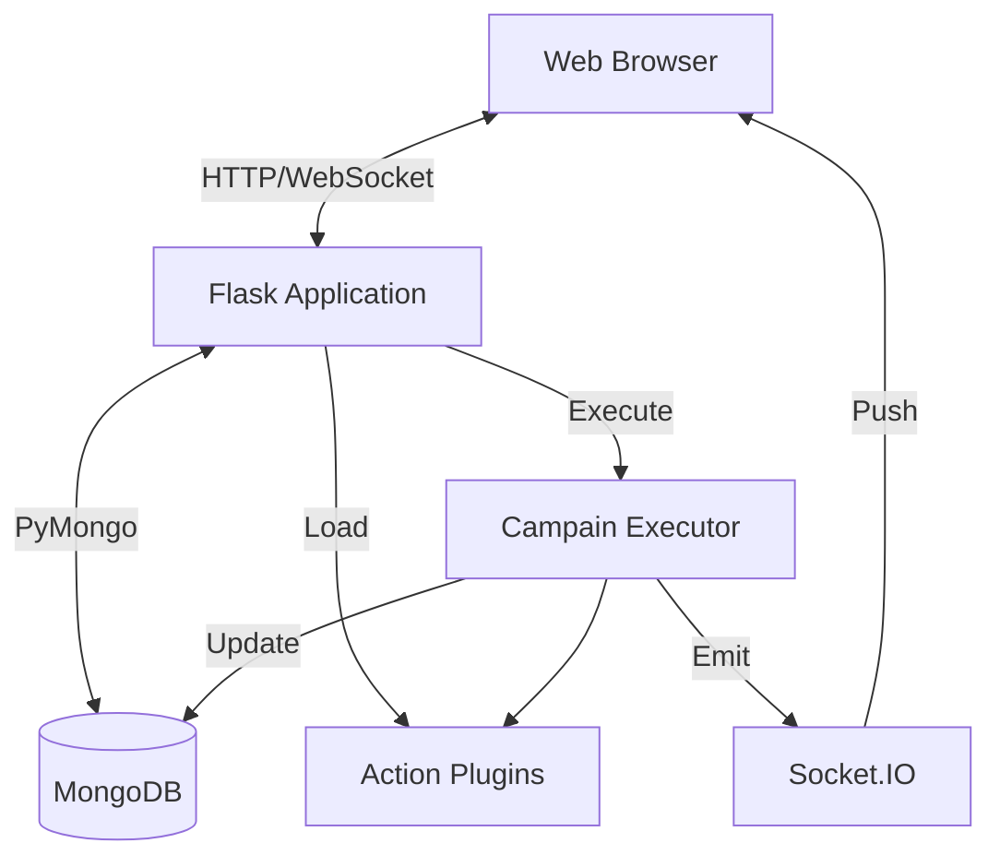

# 架构概览

TestGyver 是单体 Web 应用，配合模块化插件系统。

## 高层架构

## 核心组件

### 1. Flask 应用 (`app.py`)
入口，初始化数据库、JWT、蓝图、SocketIO、插件管理。

### 2. 数据层 (`models/`)
基于 PyMongo 的 MongoDB 抽象。
*   Users / Variables / Campaigns & Tests / Reports

### 3. 插件系统 (`plugins/`)
动态发现与加载动作插件。
*   PluginManager 负责扫描与注册
*   ActionBase 为抽象基类

### 4. 执行引擎 (`utils/campain_executor.py`)
后台线程/进程。
*   迭代测试与动作
*   变量解析
*   日志与耗时
*   更新数据库并推送 WebSocket

### 5. 前端
*   Jinja2, Bootstrap 5, jQuery/原生 JS
*   Socket.IO 客户端用于实时更新
