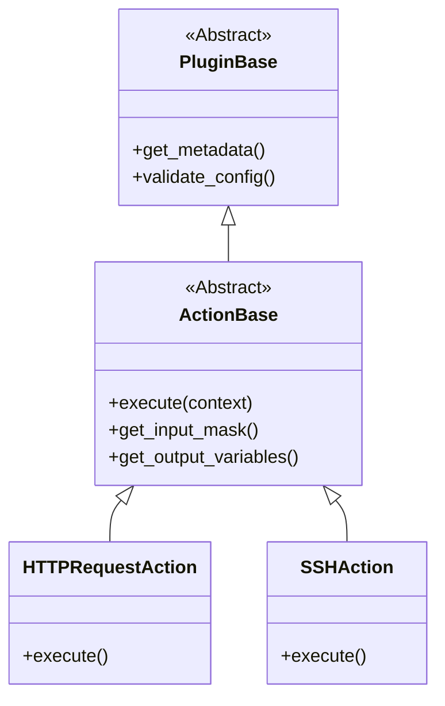

# 插件系统架构

插件系统可扩展、低耦合，无需改核心即可添加功能。

## 类层次

## 插件管理器

`PluginManager` (`plugins/plugin_manager.py`) 负责：
1.  **发现**：扫描 `plugins/actions/`。
2.  **加载**：动态导入模块。
3.  **注册**：校验继承 `ActionBase` 并登记。

## 生命周期

1.  **启动**：`app.py` 初始化并加载插件。
2.  **UI**：添加动作时通过 API 获取插件列表及输入模板。
3.  **执行**：`CampainExecutor` 按名称找到类，实例化并调用 `execute()`。
